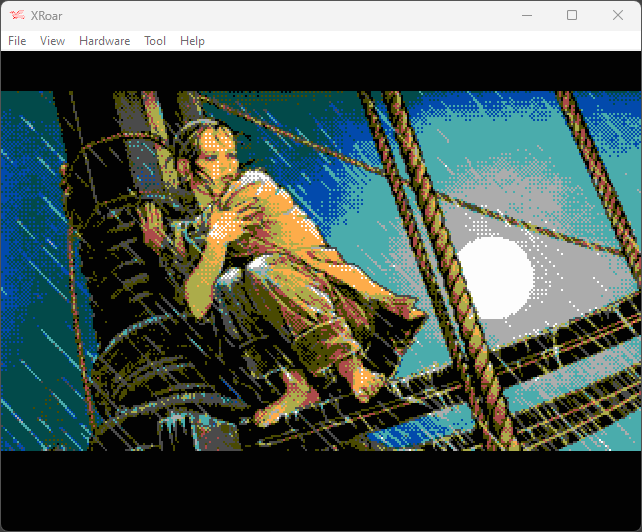

# CocoGraphics
Graphic experimentations on Tandy Coco 3

# Howto
How to display an image on a COCO3 (at least on XRoar, not tested on a real one).

Requirements: gcc, awk, cmoc, xroar, imgtool

- First, compile convert.c (tool to convert an image to coco format)
```
cmake .
make
```

- Convert an image to coco format with convert (2d argument is 0 for 320x200, 1 for 640x200)
```
./convert [image_filename] 0
```

- Then adapt COCOMakefile variables
```
IMAGE_PREFIX = [image_prefix]
IMAGE_CHUNKS = [number of chunks (.co files), should be 4]
```

- Launch replaceAndRun target. It will modify _pixel.c source to load the image, 
compile the source, create a virtual floppy with the image and launch XRoar
```
make -f COCOMakefile replaceAndRun
```

- Finally, under XRoar, exec basic loader
```
RUN "P"
```

# Links
- [Understaning COCO 3 MMU](https://subethasoftware.com/2020/04/19/understanding-and-using-the-coco-3-mmu/)
- [How to display an sprite on a COCO](https://www.chibiakumas.com/6809/platform.php#LessonP9)
- [CMOC 6809 C compiler](http://perso.b2b2c.ca/~sarrazip/dev/cmoc.html)
- [High quality quantizing and dithering library](https://github.com/exoticorn/exoquant)

# Samples
## 320x200 (en 16 couleurs)


## 640x200 (en 4 couleurs)

