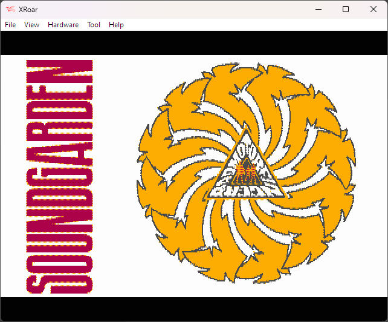

# CocoGraphics
Graphic experimentations on Tandy Coco 3

# Howto
How to display an image on a COCO3 (at least on XRoar, not tested on a real one).
...

# Links
- [Understaning COCO 3 MMU](https://subethasoftware.com/2020/04/19/understanding-and-using-the-coco-3-mmu/)
- [How to display an sprite on a COCO](https://www.chibiakumas.com/6809/platform.php#LessonP9)
- [CMOC 6809 C compiler](http://perso.b2b2c.ca/~sarrazip/dev/cmoc.html)
- [High quality quantizing and dithering library](https://github.com/exoticorn/exoquant)

# Samples
## 320x200 (en 16 couleurs)

## 640x200 (en 4 couleurs)

